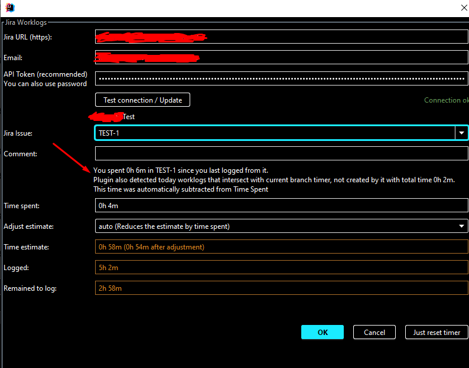
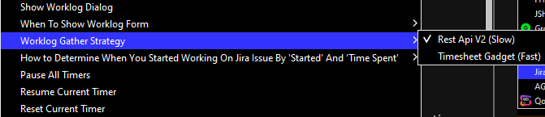
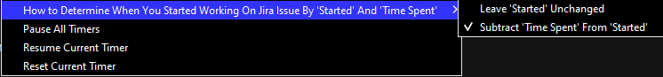

# Jira Worklog Intellij Idea Plugin

This plugin helps you with worklog management in Jira.

You can install it via Settings → Plugins → Install Plugin from Disk... (no need to unzip)

It works like this:

When you change a branch locally 
(for example, create it or switch to an existing one), 
the plugin creates a timer for this branch (or uses an existing one).

Now when you push to a remote repository, change a branch, or close a project, 
you will be prompted with the following form:


Enter the required data, click OK, a confirmation dialog will appear, after confirmation, 
the worklog will be sent to Jira and the timer will be reset.


A little about the features of the plugin:

* The plugin sets issue in the form based on the branch name 
or if you specify a commit message containing Jira issue.

The commit message is given priority.

The branch name (or commit) must contain the ID of the Jira issue. 
The regular expression for it is as follows:

```regexp
[A-Z\d]+-\d+
```

When merging, the target branch (branch0, branch1, branch* is used with following regular expression:

```regexp
(Merge branch .+ into (?<branch0>.+))|
(Merge remote-tracking branch .+ into (?<branch1>.+))|
(Merge branch .+ of .+ into (?<branch2>.+))
```


* The plugin writes how much time you spent in the current branch 
(an inscription `You spent 0h 30m in JIRAISSUE-1 since you last logged from it`),
the same time is automatically set in the `Time spent` field, which will be sent to Jira upon confirmation.


* The plugin also keeps track of the worklogs that you manually add in the Jira. 
If it detects an intersection with the current timer (including worklogs submitted via plugin from another project in Intellij), 
it will warn you about this and automatically subtract this time from `Time Spent`.
Example:




* You can also manually search for tasks (by ID or by name).
   A brief description of the task will be displayed above the search field.


* When you close the project, all timers are paused.
   When you change a branch, the timer corresponding to the branch you are moving from is also paused.


* When you delete a branch, all information stored about that branch is also deleted.


* The plugin settings window looks like this:


* Worklog Gather Strategy has three options:



It defines how the plugin should get a summary of today's
workday to display total time logged in Jira.

The first option is RestApiV2 (slow).
It uses a Jira Rest Api and may be suitable for you
if your Jira does not contain issues that have a lot of worklogs.

The second option requires the Timesheet Reports & Gadgets plugin in Jira,
but is significantly faster.

The third option requires the Tempo Timesheets plugin. This functionality is not tested though, 
because I have no access to Jira with Tempo plugin installed. If you find any problems, please create an issue.
Especially I'm unsure about time zones returned from rest API of Tempo. 
Are they all UTC or user-specific/server-specific? For now, it works in assumption that they all are UTC.


* There is also a setting with a very long name (I really have no idea how to name it):



It defines how the plugin will understand the actual start time of the worklog in Jira.
The plugin receives two fields from Jira, when the worklog was started ('Started')
and how much time was spent on it ('Time Spent').

Most people (including me and my colleagues) don't bother
adding worklogs with the actual start time of an issue.
For these people, the `actual start time = 'Started' minus the 'Time Spent'`.
If you fall into this category you should select `Subtract 'Time Spent' From 'Started'`

But there are people who, when adding the worklog, themselves subtract the time they spent on the issue from the current time.
If you are one of these choose `Leave 'Started' Unchanged`


* The plugin shows what time you have worked for today (`Logged` field)
and how much is left in accordance with the 8-hour working day (`Remained to log` field).
This data is taken from your Jira profile in the way you choose in `Worklog Gather Strategy`.


* You do not need to enter Jira Url / Username / Password each time, it is enough to do this once for the project.


* It is also possible to adjust estimates:
   * by default - `auto`, the estimate will be reduced by the deducted time,
   * `new` -- new estimate,
   * `leave` -- leave the estimate as is,
   * `manual` -- reduce the estimate by the specified time.


* If you put the computer into sleep mode or the Intellij closes in an abnormal way - 
the time of absence will not be counted in `Time spent` as soon as it exceeds one minute.
For example, if Intellij crashed, you quickly launched it, and it all took 30 seconds - 
then these 30 seconds will be taken into account in `Time spent`. 
If a minute or more has passed, this time will not be taken into account in `Time spent`.


* Timers that have been paused for more than a week are periodically deleted.


* When renaming a branch, the time from the source branch is transferred to the target branch, the timer of the source branch is deleted.


The plugin has several limitations/specifics:

* It only works with projects that have exactly one git repository

* You can't simultaneously add worklogs to 2 or more Jira issues

* The timers are updated periodically, 
once every 10 seconds active timers are selected (under normal conditions only one should be active) and updated. 
When updating, the timer checks that the time difference between the previous update and the current one exceeds 
the update period by no more than 6 times 
(for example, with an update period of 10 seconds, 61 seconds already exceeds). 
If it exceeds, such an update is skipped.

* If 2 or more projects are open in the Intellij - the timers will be updated in all projects

* For the correct work of all functions, notifications in the Intellij must be enabled

* Jira Rest Api version 2 is required

* The plugin marks each worklog it creates by adding a `Created by Jira Worklog Plugin: ${projectName}` to the beginning of the comment 

* RestApiV2 worklog gather strategy will not work if you work logged to Jira Issue that contains >1000 worklogs. It's Jira's bug https://jira.atlassian.com/browse/JRACLOUD-73630. Although in the link it is about `startedAfter` parameter not working, any parameter described in API's documentation https://developer.atlassian.com/cloud/jira/platform/rest/v2/api-group-issue-worklogs/ doesn't work.
